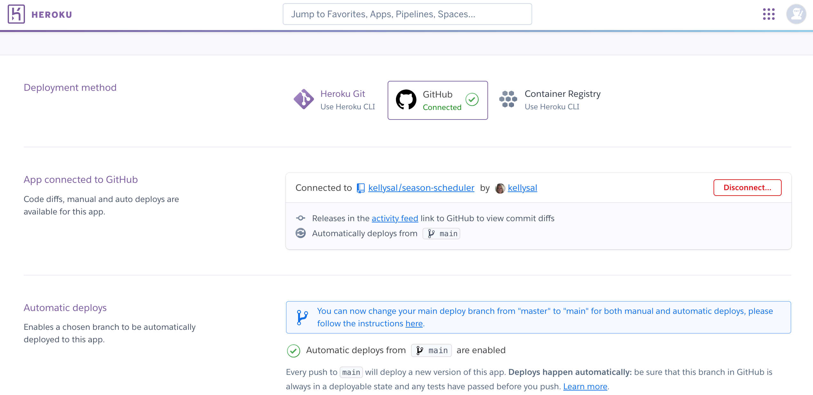
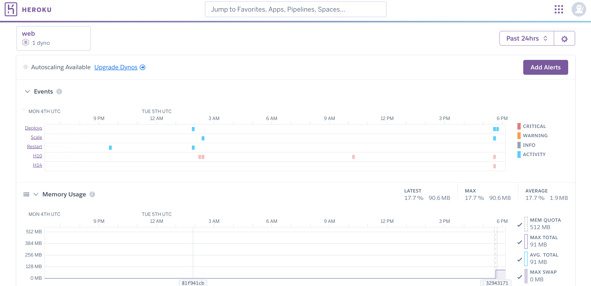
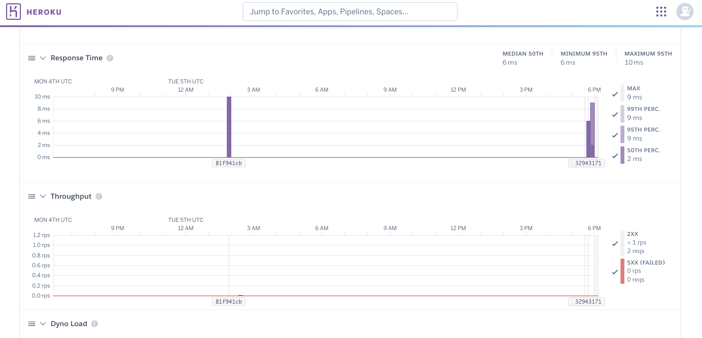
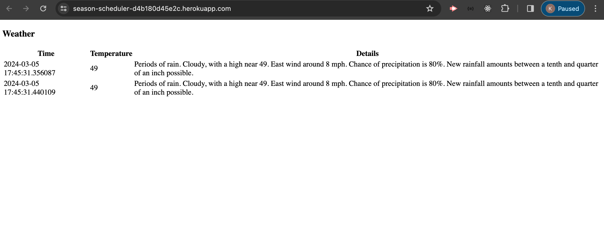
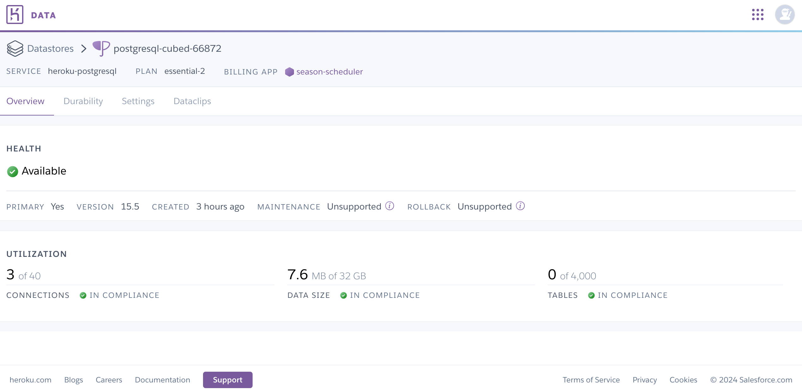

# Season Scheduler

1. What problem is the product aimed at solving?

Seasonal Scheduling on demand. Developing a site that tackles booking a snow plow service on demand. I plan to use a free weather api to collect & analyze weather data + display snow plow recommendations for on demand booking.

2. Who is the product geared towards (targeted audience)?

The target audience is people living in a cold climate who do not want to commit to a snow plow service (which can be expensive and limiting).

3. How is the product unique?

This product is unique because it allows users the flexibility to book a snow plow service on demand with a weather guide.

# App Overview

### System Requirements

Python was used to develop this web app

A Python3 environment is required with all dependencies from requirement.txt

Postgres Database

### Design Decisions

Developed this web app using Python and Flask because of it's lightweight flexibility. Decided on a SQL database because of scalability and simple integration on Heroku. CI/CD created in Heroku because of the streamlined integration.

### Architecture/Whiteboard

USER [interacts with web app]

⬇️

[+ messaging queue]

⬇️

WEB (APP) → [displays weather data + snow plow recommendations]

⬆️

DATA ANALYZER (APP) →[get the data from the database and analyze if a storm is on the way/snow plow services are recommended]

⬆️

DATABASE [drop weather data off in database]

⬆️

DATA COLLECTOR (APP) → [go out & collect weather data from openweatherapi + bring data back + schedule process to collect data (cron)]

### Continuous Delivery

This app is integrated with GitHub to easily deploy with Heroku.

### Monitoring & Performance Metrics

This app is using Heroku monitoring to monitor the app's health (including: events, memory, response and throughput)

### Web App
The season scheduler web app is a Python Flask app which uses http requests to collect data from api.weather.gov

### Data Collection

The season scheduler web app uses Python requests to collect weather data. The collected data is inserted into the postgresql database in heroku.

### Data Analyzer

The season scheduler analyzes the collected data (temperature and details from weather api) and decides if a snow plow is needed.

### Unit Tests

Utilizing unit and integration tests running in Heroku

### Frontend

Using a Python Flask stack due to the lightweight flexibility

# Production Environment

Visit Production App Hosted on Heroku [here >>](https://season-scheduler-d4b180d45e2c.herokuapp.com/)

# Local

`python3 -m venv venv && source ./venv/bin/activate`

`pip install -r requirements.txt`

`export FLASK_APP=src/app.py`

`flask run`

## Future Features 🔮

1. Add scheduler functionality

2. Add weather alerts in app